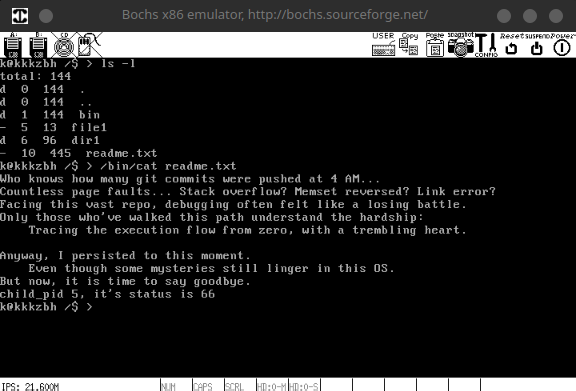
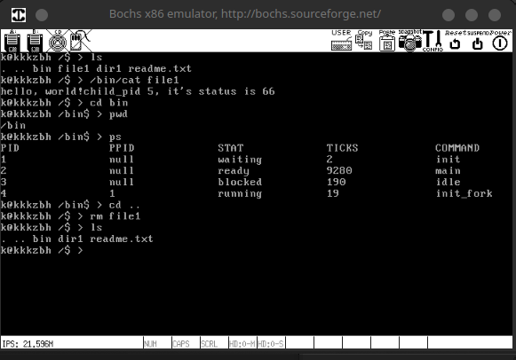
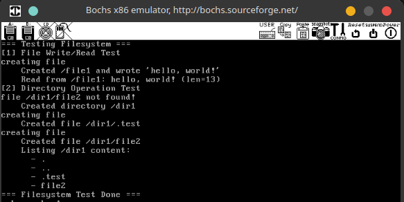
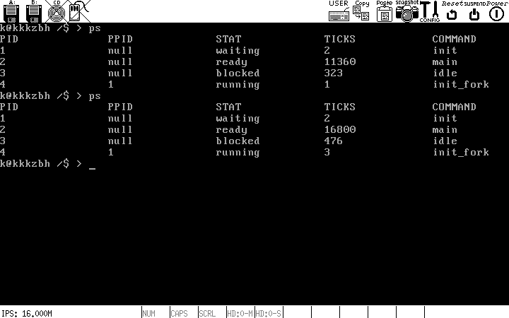

# knix

English | [简体中文](README.zh-CN.md)

`knix` is a 32-bit x86 experimental operating system built from the boot sector all the way to a user-space shell.

It connects the main operating-system pipeline end to end: MBR, Loader, kernel initialization, interrupts, memory management, threads, processes, file system, system calls, and user-program execution.



## What You Can See Now

| Shell interaction | File-system test |
| --- | --- |
|  |  |

## Project Focus

The goal of `knix` is straightforward: bring up a minimal but real operating system and make the boot process, shell, process management, and file-system workflow directly observable.

- Boots from a raw disk image and enters the kernel through `MBR -> Loader -> Kernel`.
- Completes basic initialization for protected mode, paging, interrupts, timer, keyboard, and thread scheduling.
- Runs a shell in user space and accesses kernel capabilities through system calls.
- Creates directories, reads and writes files, traverses directories, and runs file-system regression scenarios.
- Executes user programs and covers process-lifecycle operations such as `fork / exec / wait / exit`.



## Quick Start

The current repository uses `CMake + Ninja` as the build entry point. On the local machine, the recommended CMake binary is the one bundled with CLion Toolbox:

```bash
/home/kkkzbh/.local/share/JetBrains/Toolbox/apps/clion/bin/cmake/linux/x64/bin/cmake \
  -S . -B build -G Ninja

/home/kkkzbh/.local/share/JetBrains/Toolbox/apps/clion/bin/cmake/linux/x64/bin/cmake \
  --build build --target osbuild

/home/kkkzbh/.local/share/JetBrains/Toolbox/apps/clion/bin/cmake/linux/x64/bin/cmake \
  --build build --target bochs
```

After entering the shell, you can try:

```text
ls
pwd
ps
mkdir /tmp
cd /tmp
```
